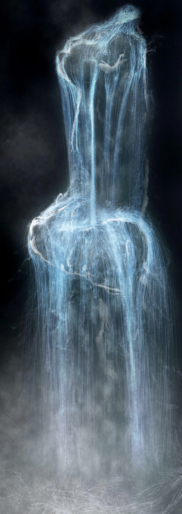
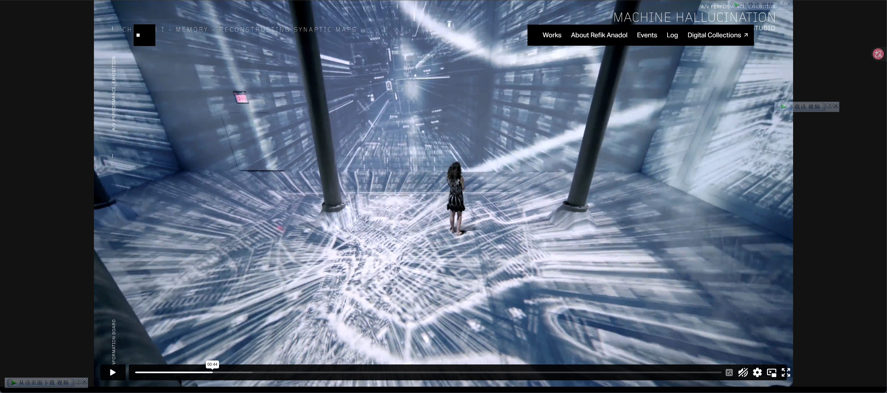
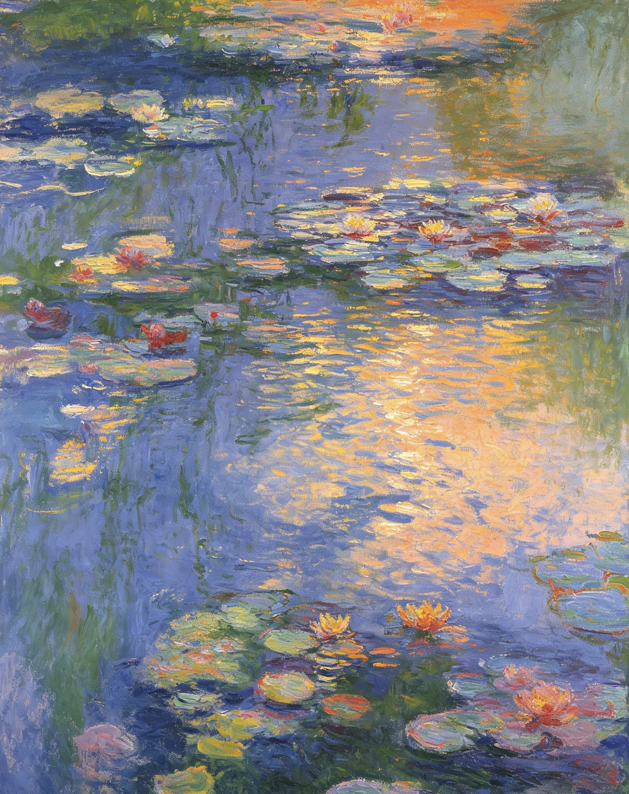
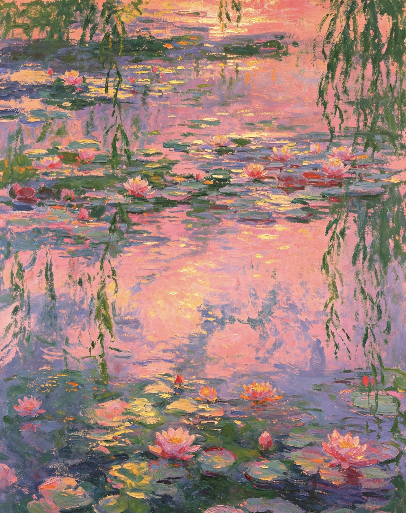
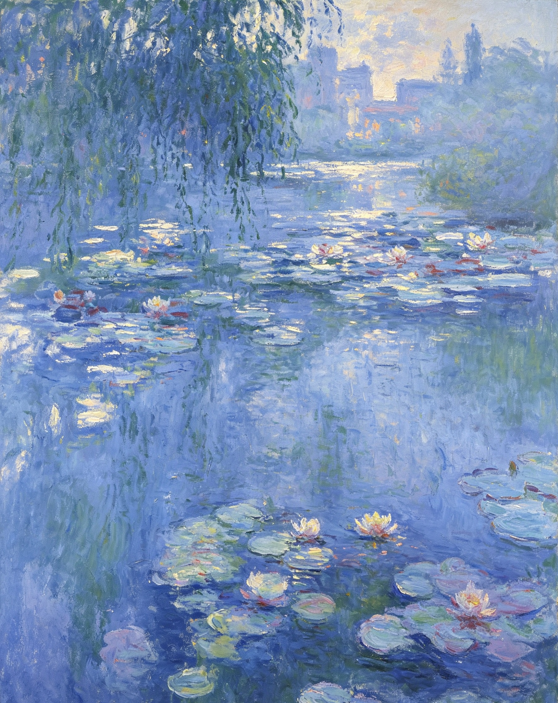
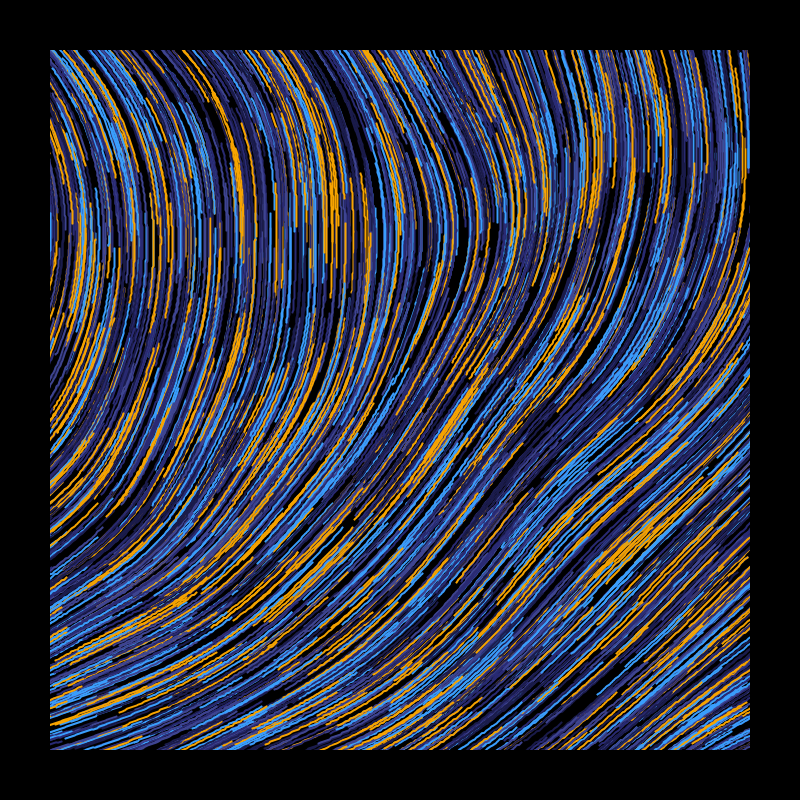
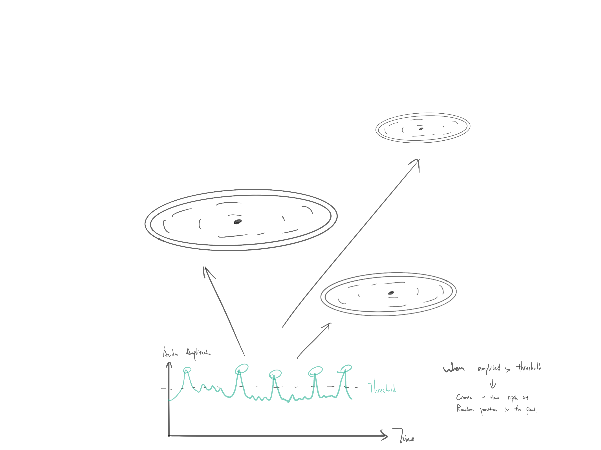
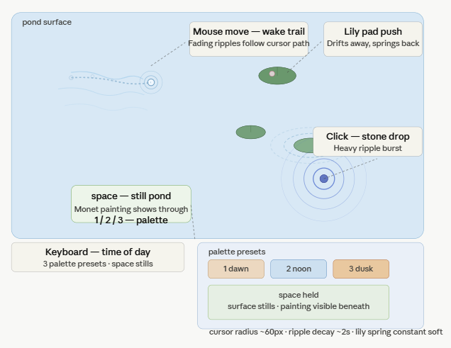

# IDEA9103 Final Project — Pitch

**Project title:** *Pond, Re-rendered*

**Team:**
- Jingrou Lin — *Time-based mechanic*
- Jinge Gao — *Perlin noise + randomness mechanic*
- Yuchong Xue — *Audio mechanic*
- Kaylin Zhang — *User input mechanic*

**Course:** IDEA9103 — Creative Coding
**Submission:** Quiz 9 — Final Project Pitch

---

## Part 1 — Project Direction

**Project path:** Reinterpret an existing artwork.

**Artwork:** *Water Lilies*, 1916, by **Claude Monet**. Oil on canvas, ~200 × 200 cm. Collection of The National Museum of Western Art, Tokyo.

*Claude Monet, Water Lilies, 1916. Original reference for our reinterpretation.*

### Our Vision

We will reinterpret Monet's *Water Lilies* (1916) as a **living, listening pond** — a single square of water that breathes, brightens, ripples, and responds. Monet spent the last thirty years of his life painting the same pond at Giverny, chasing how its surface changed under shifting light and weather; each canvas is a frozen instant of that study. Our reinterpretation gives those instants back their motion. Inspiration comes from **teamLab's *Universe of Water Particles*** seen at Mori Building Digital Art Museum, and **Refik Anadol's *Machine Hallucinations*** data-paintings. We modify Monet's pond by letting **time, noise, sound, and touch** each become one kind of weather over the water — four hands moving the same surface.

*teamLab, Universe of Water Particles, ongoing — inspiration for interactive water as a continuous generative surface.*

*Refik Anadol, Machine Hallucinations — inspiration for treating a painting as a living, re-rendered data field.*

---

## Part 2 — Mechanics

Each team member owns one mechanic. All four mechanics act on the same canvas — Monet's pond — but at different layers and through different inputs.

### 🕐 Time-based — *Jingrou Lin*

The time-based mechanic controls the **mood of the entire pond** as a slow weather cycle. Using `millis()` and `frameCount`, the canvas progresses through a three-minute loop that shifts the palette from cool morning blue (~5 AM) to warm dusk pink (~7 PM) and back. As the cycle advances, reflection colours dim, the green of the lily pads desaturates, and the depth of the water — rendered as a vertical gradient — deepens. A subtle event scheduler triggers occasional gusts of wind that briefly accelerate ripple decay across the pond. This mechanic is the **clock of the piece** — it does not move objects, but it changes how every other layer looks, so audio ripples born at 5 AM glow cold blue while ripples born at dusk glow warm rose. It connects directly to Monet's lifelong subject: *the same water under different light*.

*Reference 1 — morning light: cool blue palette, soft reflections.*

*Reference 2 — noon light: saturated greens, sharper lily pad contrast.*

*Reference 3 — dusk light: warm pink and rose tones, dimmed reflections.*

*Monet painted the same pond at sunrise, noon, and dusk — this mechanic compresses that lifelong study into one loop.*

---

### 🌊 Perlin noise + randomness — *Jinge Gao*

The Perlin noise mechanic is the **water itself**. Every pixel of the pond surface is displaced horizontally and vertically by a 2D Perlin noise field (`noise(x * scale, y * scale, t)`), so the reflections of lily pads and willow leaves wobble continuously rather than sit static. The noise scale and time offset (`t`) determine how chaotic the water looks — a small scale gives a calm glassy surface, a large scale gives a stirred, turbulent one. Layered on top, **`random()` calls** scatter small specular highlights — tiny flecks of light glinting off the water — at fresh positions each frame, mimicking sun glitter on real ponds. Crucially, Perlin's displacement amplitude is **modulated by the audio mechanic**: louder sound doubles the turbulence, so the water visually "hears" what the microphone hears. This mechanic connects the piece by giving every other layer its medium: time tints the water, audio disturbs the water, the cursor touches the water — but the water itself is Perlin.

*Perlin-noise-driven water surface — reference for displacement-based reflection wobble.*

---

### 🔊 Audio — *Yuchong Xue*

The audio mechanic listens through the browser microphone using **p5.js `p5.AudioIn` and `p5.FFT`**, treating every sound in the room as **a drop falling into the pond**. Every time the audio amplitude crosses a beat threshold, an expanding ripple ring is spawned at a random pond position; the ring grows outward, fades, and disturbs lily pads it passes through. Frequency content — low and high bands — is mapped to ripple colour and ring thickness, so a deep bass note produces a slow heavy ring while a high voice produces fast thin ones. The mechanic also exposes a global `audioLevel` variable read by Perlin (to amplify water turbulence) and by Time (to softly modulate ambient brightness on loud passages). This connects to the piece by making the pond **acoustically alive** — viewers can clap, speak, or play music and watch the water answer.

*Cymatic patterns — sound visualised as water ripples, reference for the audio-to-ripple mapping.*

---

### 🖱️ User input — *Kaylin Zhang*

The user input mechanic puts **a finger in the water**. The cursor's position and movement are tracked every frame: as the mouse moves over the pond, it leaves a **fading wake of ripples** behind it; lily pads within a small radius are gently pushed away from the cursor and drift back when it leaves. A `mousePressed()` event drops a heavier ripple — like a small stone breaking the surface — that briefly amplifies Perlin's local turbulence around the impact point. Keyboard input adds two simple controls: pressing space briefly stills the entire pond (so the viewer can see Monet's painting underneath), and pressing 1–3 swaps between three different palette presets that bias the time-of-day colour. This mechanic is the **invitation** — it turns a generative painting into a place the viewer can reach into, which is the part of the piece that holds attention longest.

*Interactive water installations — reference for cursor-as-finger ripple interaction.*

---

## Part 3 — Putting It Together

The four mechanics share Monet's pond as four stacked layers of the same water. **Jingrou's time-based** layer shifts the palette from cool morning blue to warm dusk pink over 3 minutes, dimming the reflections. **Jinge's Perlin noise** displaces the water surface horizontally, making reflections wobble. **Yuchong's audio** input spawns expanding ripple rings at random positions on every beat. **Kaylin's user input** lets the cursor push lilies away and trail ripples behind it. They influence each other: louder audio doubles Perlin's displacement, and time-of-day tints every ripple's colour.

